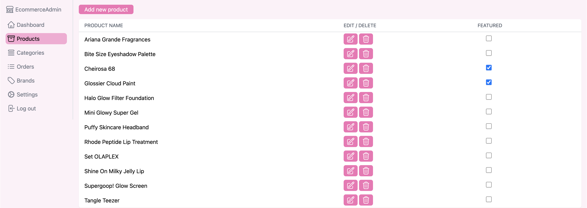
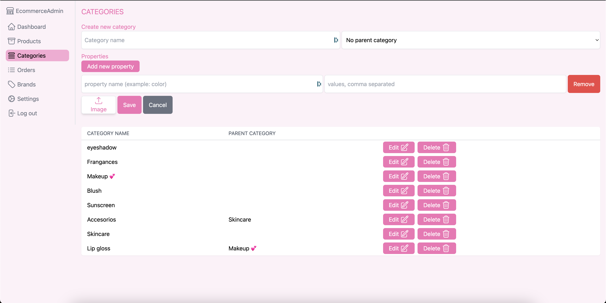
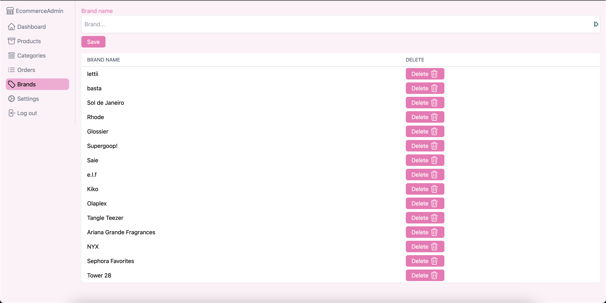
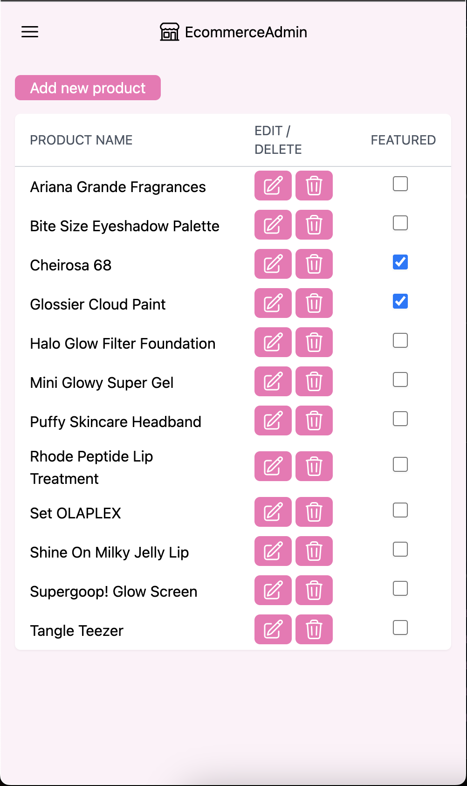
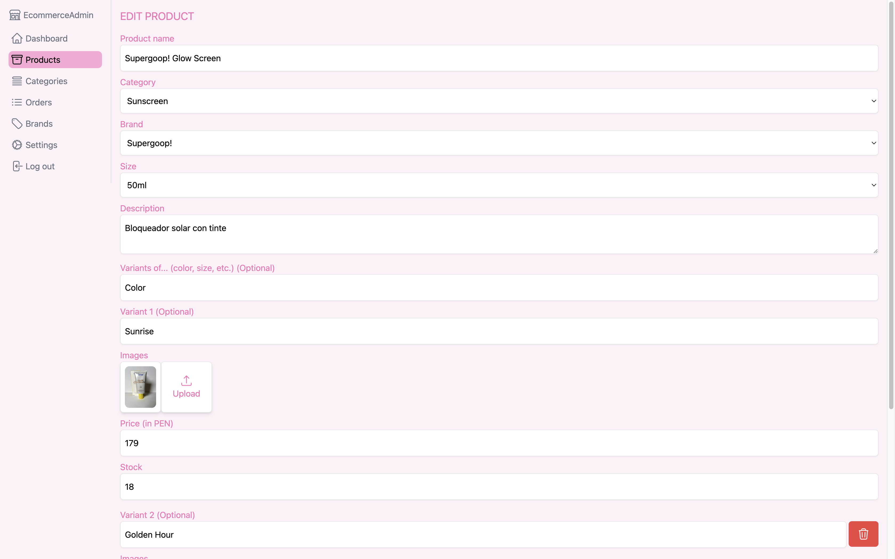
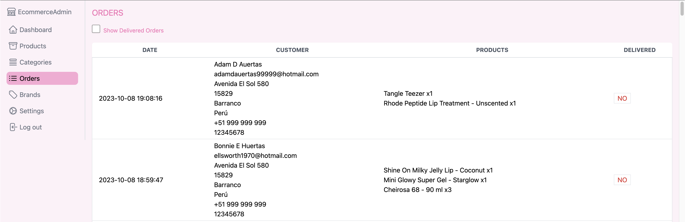

<div align="center">

  
  <h1>E-commerce-Admin (The Bestiehood)</h1>

  <!-- <h2>
   :star: <a href="https://bestiehood-admin.vercel.app/">Check out the website!</a> :star:
  </h2>  -->
  
</div>

<!-- Table of Contents -->

# :notebook_with_decorative_cover: Table of Contents

- [:notebook\_with\_decorative\_cover: Table of Contents](#notebook_with_decorative_cover-table-of-contents)
  - [:star2: About the Project](#star2-about-the-project)
    - [:notebook: Description](#notebook-description)
    - [:eyes: Features](#eyes-features)
    - [:camera: Screenshots](#camera-screenshots)
    - [:space\_invader: Tech Stack](#space_invader-tech-stack)
    - [:key: Environment Variables](#key-environment-variables)
  - [:toolbox: Getting Started](#toolbox-getting-started)
    - [:bangbang: Prerequisites](#bangbang-prerequisites)
    - [:gear: Setup](#gear-setup)

<!-- About the Project -->

## :star2: About the Project

<!-- Description -->

### :notebook: Description

<p>
Admin page for <a href="https://github.com/nidorbRotkiv/E-commerce-Front">E-commerce.</a>
</p>

<!-- Features -->

### :eyes: Features

- Create products, categories and brands.
- Follow up on orders
- Google authentication.
- Add images to products and categories that are then uploaded to AWS.
- Check up on revenue and amount of orders for different time periods. 
- Select featured products for the e-commerce.

<!-- Screenshots -->

### :camera: Screenshots

<div align="center"> 
 
</div>

<div align="center"> 
 
</div>

<div align="center"> 
 
</div>

<div align="center"> 
 
</div>

<div align="center"> 
 
</div>

<div align="center"> 
 
</div>

<!-- TechStack -->

### :space_invader: Tech Stack

 <ul>
    <li><a href="https://www.javascript.com/">JavaScript</a></li>
    <li><a href="https://nodejs.org/">Node.js</a></li>
    <li><a href="https://nextjs.org/">Next.js</a></li>
    <li><a href="https://react.dev/">React.js</a></li>
    <li><a href="https://www.mongodb.com/">MongoDB</a></li>
    <li><a href="https://tailwindcss.com/">Tailwind CSS</a></li>
    <li><a href="https://aws.amazon.com/s3/">Amazon S3</a></li>
    <li><a href="https://cloud.google.com/">Google Cloud</a></li>
  </ul>

<!-- Env Variables -->

### :key: Environment Variables

To run this project, you will need to add the following environment variables to your .env file

`GOOGLE_ID`

`GOOGLE_SECRET`

`MONGODB_URI`

`S3_ACCESS_KEY`

`S3_SECRET_ACCESS_KEY`

`ADMIN_EMAILS`

`SECRET`

<!-- Getting Started -->

## :toolbox: Getting Started

<!-- Prerequisites -->

### :bangbang: Prerequisites

 <ul>
    <li><a href="https://www.mongodb.com/">MongoDB</a></li>
    <li><a href="https://tailwindcss.com/">Tailwind CSS</a></li>
    <li><a href="https://aws.amazon.com/s3/">Amazon S3</a></li>
    <li><a href="https://cloud.google.com/">Google Cloud</a></li>
 </ul>

### :gear: Setup

Clone the project

```bash
  git clone https://github.com/nidorbRotkiv/E-commerce-Admin.git
```

yarn commands

```bash
# install dependencies
$ yarn install

# serve with hot reload at localhost:3001
$ yarn dev
```

For detailed explanation on how things work, check out the [documentation](https://nextjs.org/).
